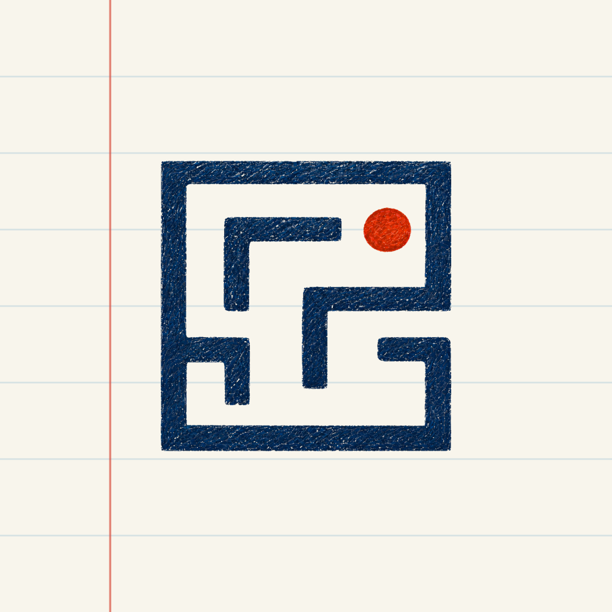
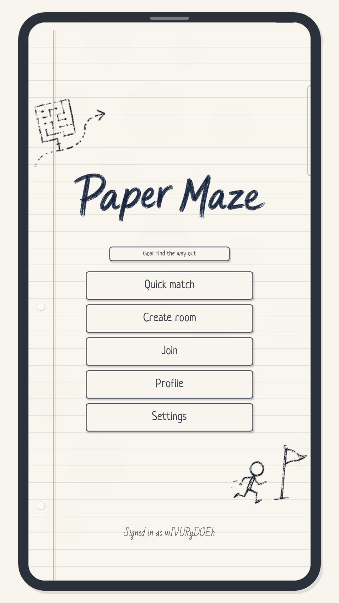
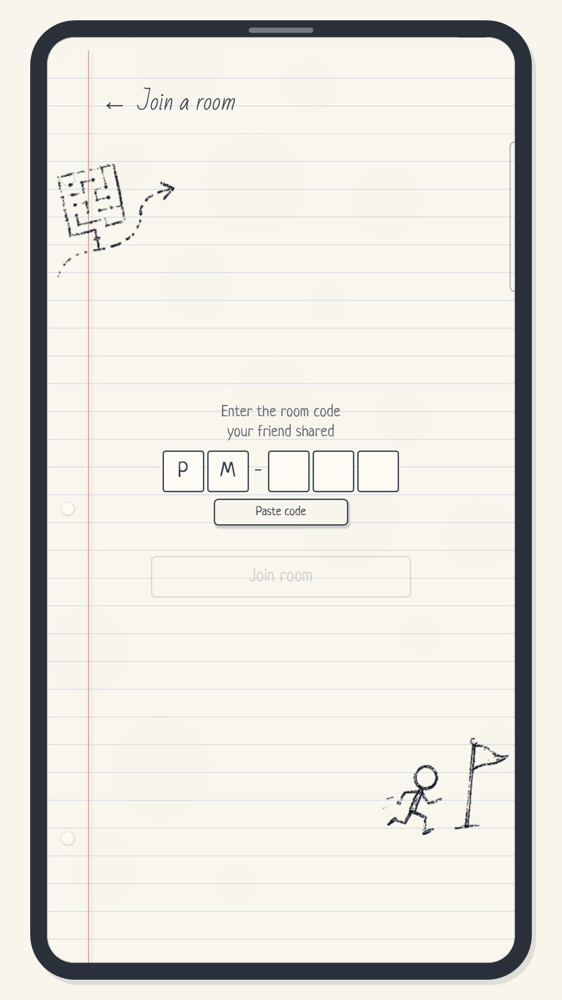
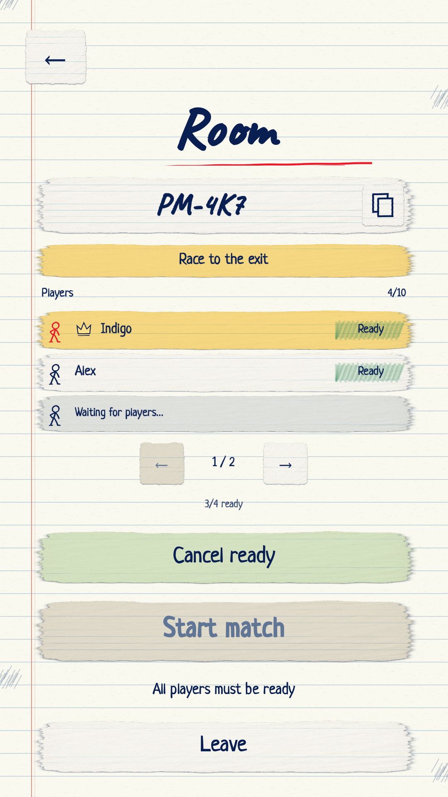
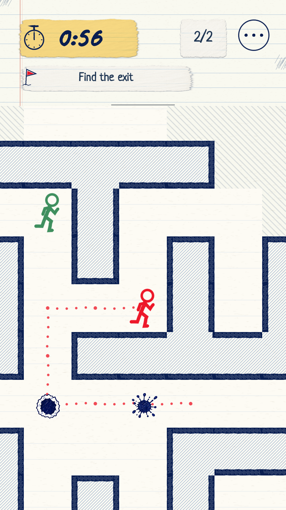

# Paper Maze Multiplayer — landing page

  

**Paper Maze** is a real-time multiplayer maze race for 2–10 players, drawn like a page from a notebook: make a room, share the code, and be the first to find the way out.

[**Download on the App Store**](https://apps.apple.com/ua/app/paper-maze-multiplayer/id6796745132) · [**Landing page**](https://bogdangolub.github.io/paper-maze-pages/) · [Support](https://bogdangolub.github.io/paper-maze-pages/support.html) · [Privacy policy](https://bogdangolub.github.io/paper-maze-pages/legal/privacy-policy.html)

  
  
  
  

## What this repository is

The static site behind [bogdangolub.github.io/paper-maze-pages](https://bogdangolub.github.io/paper-maze-pages/): the landing page, the support page, the account-deletion page and the privacy policy, published with GitHub Pages. The game client and server are closed-source; this repo is the public face of the project.

## How the game is built

Paper Maze is a solo project, built end-to-end by [Bohdan Holub](https://github.com/BogdanGolub):

- **Client** — Godot 4 (iOS on the App Store; Android in progress), with the hand-drawn notebook look done in-engine.
- **Server** — an authoritative multiplayer server on [Nakama](https://heroiclabs.com/nakama/) with a TypeScript runtime and PostgreSQL. Every move is validated server-side (sequence, cooldown, walls, room state), mazes are generated procedurally per match.
- **Networking** — WebSocket at a 20 Hz tick with delta updates; a dropped player gets a grace period to reconnect and rejoin the race in progress.
- **Delivery** — fastlane (`match`, TestFlight, App Store, Play beta), a GitHub Actions nightly test harness, and protocol-level two-client simulation tests that play whole matches against the server logic.
- **Localization** — English, Ukrainian and Russian.

## Site

Plain HTML/CSS, no build step. Fonts and images live in `assets/`; legal texts in `legal/`.
